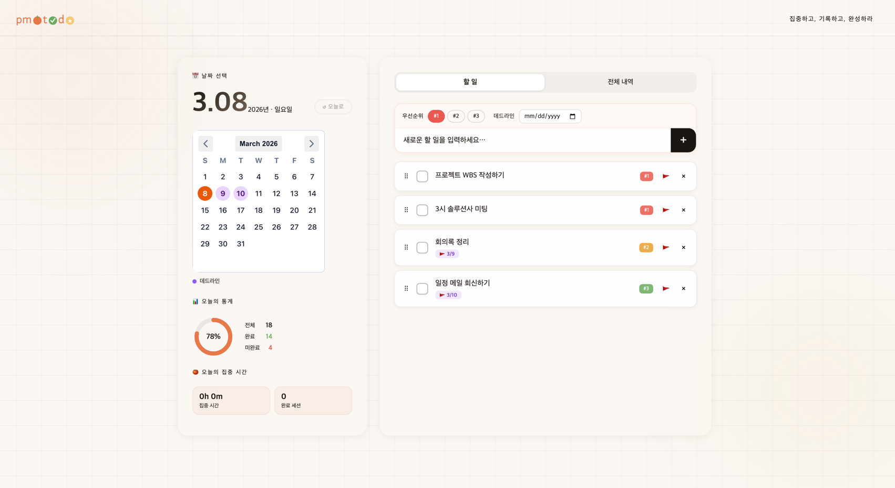
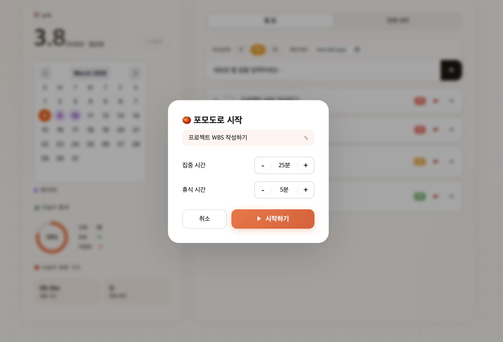
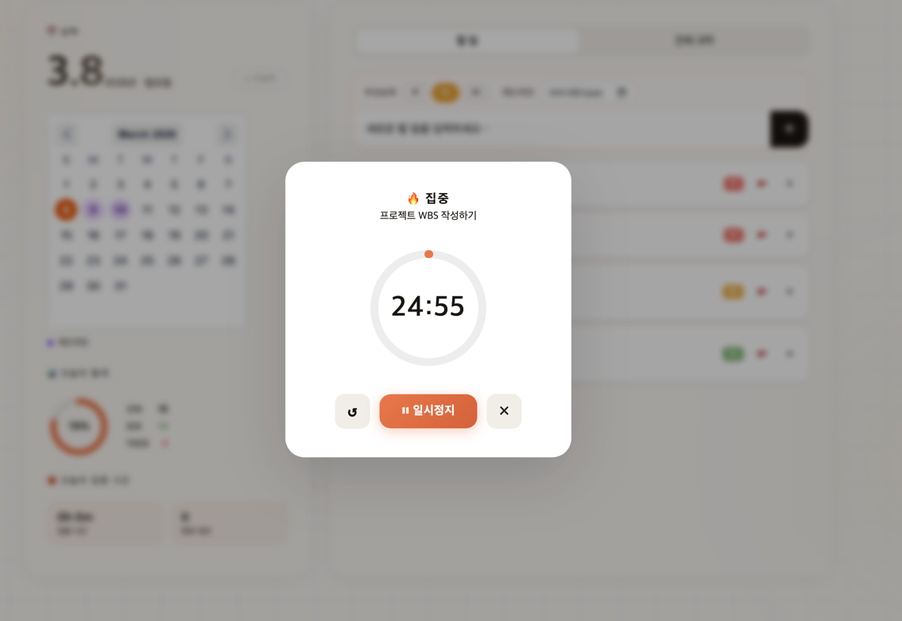

<div align="center">

# 🍅 Pomotodo

**집중하고, 기록하고, 완성하라**

포모도로 타이머와 할 일 관리를 하나로 합친 생산성 앱


</div>

---

## ✨ 주요 기능

| 기능 | 설명 |
|------|------|
| 📅 **달력 기반 할 일 관리** | 날짜를 선택해 그날의 할 일을 조회·추가 |
| 🍅 **포모도로 타이머** | 태스크별 집중/휴식 타이머, 세션 시간 자동 누적 |
| 🚩 **데드라인 설정** | 태스크에 마감일 지정, 달력에 시각적으로 표시 |
| 🔢 **우선순위 정렬** | #1(긴급) / #2(보통) / #3(여유) 3단계 우선순위 |
| ↕️ **드래그 앤 드롭** | 같은 우선순위 그룹 내에서 자유롭게 순서 변경 |
| 📊 **일별 통계** | 날짜별 완료율 도넛 차트, 집중 시간 카드 |
| 📂 **전체 내역** | 전체 태스크 한눈에 조회 및 관리 |
| 🔁 **누적 미완료** | 이전 날짜의 미완료 태스크를 오늘 목록에 자동 표시 |

---

## 🖥️ 스크린샷

> _달력 + 할 일 + 포모도로가 하나의 화면에_




---

## 🏗️ 기술 스택

### Frontend
- **Vue 3** (Composition API + `<script setup>`)
- **Vite 7** — 빌드 도구
- **v-calendar** — 달력 컴포넌트
- **axios** — HTTP 클라이언트
- **TypeScript**

### Backend
- **Spring Boot 4.0** (Spring MVC)
- **Spring Data JPA** + **Hibernate**
- **PostgreSQL** — 메인 데이터베이스
- **Lombok**
- **Java 17**

---

## 📁 프로젝트 구조

```
pomotodo/
├── frontend/                  # Vue 3 + Vite
│   ├── src/
│   │   ├── App.vue            # 메인 컴포넌트 (전체 UI)
│   │   ├── api/
│   │   │   └── tasks.js       # API 호출 모듈
│   │   └── main.ts
│   ├── package.json
│   └── vite.config.ts
│
└── backend/                   # Spring Boot
    └── src/main/java/com/shchoi/todolist/
        ├── domain/
        │   └── Task.java              # Task 엔티티
        ├── controller/
        │   ├── TaskController.java    # REST API
        │   └── dto/
        │       └── TaskCreateRequest.java
        └── repo/
            └── TaskRepository.java
```

---

## 🚀 시작하기

### 사전 요구사항

- Node.js `^20.19.0` 또는 `>=22.12.0`
- Java 17+
- PostgreSQL 실행 중

### 1. 저장소 클론

```bash
git clone https://github.com/your-username/pomotodo.git
cd pomotodo
```

### 2. 데이터베이스 설정

PostgreSQL에 데이터베이스를 생성하고 `backend/src/main/resources/application.properties`를 수정합니다.

```properties
spring.datasource.url=jdbc:postgresql://localhost:5432/pomotodo
spring.datasource.username=your_username
spring.datasource.password=your_password
spring.jpa.hibernate.ddl-auto=update
```

### 3. 백엔드 실행

```bash
cd backend
./mvnw spring-boot:run
# 또는 IntelliJ에서 ▶ 버튼 클릭
```

> 서버가 `http://localhost:8080`에서 실행됩니다.

### 4. 프론트엔드 실행

```bash
cd frontend
npm install
npm run dev
```

> 앱이 `http://localhost:5173`에서 실행됩니다.

---

## 🔌 API 명세

| Method | Endpoint | 설명 |
|--------|----------|------|
| `GET` | `/api/tasks?date={date}` | 날짜별 태스크 조회 |
| `GET` | `/api/tasks/incomplete` | 미완료 태스크 전체 조회 (deadline ASC) |
| `GET` | `/api/tasks/all` | 전체 태스크 조회 (date DESC) |
| `POST` | `/api/tasks` | 태스크 생성 |
| `PATCH` | `/api/tasks/{id}` | 태스크 수정 (title, priority, deadline) |
| `PATCH` | `/api/tasks/{id}/done` | 완료 상태 토글 |
| `DELETE` | `/api/tasks/{id}` | 태스크 삭제 |

### 요청/응답 예시

```json
// POST /api/tasks
{
  "date": "2026-03-08",
  "title": "README 작성하기",
  "priority": 1,
  "deadline": "2026-03-10"
}
```

---

## ⌨️ 사용법

### 할 일 추가
1. 오른쪽 패널 상단 입력 영역에서 우선순위(`#1`~`#3`)와 데드라인을 선택
2. 할 일 내용 입력 후 `Enter` 또는 `+` 버튼

### 포모도로 타이머
1. 태스크 제목 클릭 → 포모도로 설정 팝업
2. 집중 시간 / 휴식 시간 조정 후 **시작하기**
3. 집중 세션 완료 시 해당 날짜의 통계에 자동 누적 (localStorage 저장)

### 드래그 앤 드롭
- 태스크 왼쪽 `⠿` 핸들을 드래그해 순서 변경
- **같은 우선순위 그룹 내에서만** 이동 가능 (#1 → #2로 이동 불가)

### 데드라인 수정
- 태스크 우측 🚩 버튼 클릭 → 날짜 입력 → `Enter` 또는 포커스 해제
- 마감일이 지난 태스크는 빨간색 ⚠️ 표시

---

## 📦 빌드

### 프론트엔드 프로덕션 빌드

```bash
cd frontend
npm run build
# dist/ 폴더에 결과물 생성
```

### 백엔드 JAR/WAR 빌드

```bash
cd backend
./mvnw clean package
# target/todolist-0.0.1-SNAPSHOT.war 생성
```

---

## 🗂️ 로컬 데이터 저장

포모도로 통계는 브라우저 **localStorage**에 저장됩니다. 별도 서버 저장 없이 유지됩니다.

```json
{
  "totalFocusMin": 150,
  "sessions": 6,
  "byDate": {
    "2026-03-08": 50
  },
  "sessionsByDate": {
    "2026-03-08": 2
  }
}
```

---

## 🤝 기여

1. Fork 후 feature 브랜치 생성 (`git checkout -b feature/amazing-feature`)
2. 변경사항 커밋 (`git commit -m 'feat: add amazing feature'`)
3. 브랜치 Push (`git push origin feature/amazing-feature`)
4. Pull Request 생성

---

## 📄 라이선스

MIT License — 자유롭게 사용, 수정, 배포 가능합니다.

---

<div align="center">

Made with ☕ and 🍅

</div>